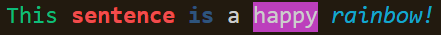

# ft_printf
First project in algorithm branch of 42 school's curriculum. Object of the project was to re-implement standard C library's `printf` function. Use of `printf` is not permitted in almost any of the 42 projects that are done using C so `ft_printf` will help in future projects. Even though their use is very similar all of the functionalities of the original `printf` were not implemented. Some bonus functionalities were added to expand usage (or just for fun).

### Declaration
```
int		ft_printf(const char *format, ...);
```

### Example of usage
The usage does not differ from that of the original except that `ft_printf` requires `ft_printf.h` which is provided in `includes/` folder to be included:
```
#include "ft_printf.h"

ft_printf("Hello %s\n", "World");
```

## Format string
Format string is the first argument of `ft_printf` that determines what is printed and in what order. Format string can be the only argument and therefore just a string to be printed or it can contain one or more format tags which requires equal amount of corresponding extra arguments for `ft_printf`.

### Call with only format string
```
ft_printf("Hello World\n");
```
#### Output:
```
Hello World
```

### Call with format tags
```
float	f;
int		nbr;

f = 2.5;
nbr = 42;
ft_printf("Hello %s %d, %f is half of 5\n", "World", nbr, f);
```
Format tags are short series of characters that always start with `%` and are placed inside of the format string. More of them in a bit.
#### Output:
```
Hello World 42, 2.5 is half of 5
```

## Format tags
Format tags are the core of the usage of `ft_printf`. They work sort of like a 'place holder' for the next corresponding arguments of `ft_printf`. The format tag will be replaced in the format string with the next argument in functions argument list. If the data types and order of the arguments is not respected in the tags, the function's behaviour will be undefined.

Format tags are always in following format: `%[flags][width][.precision][length]specifier`

## Data type specifiers

### Integer tags
- `%c` -- Character
- `%d` or `%i` -- Signed decimal integer
- `%u` -- Unsigned decimal integer
- `%o` -- Signed octal
- `%x` -- Unsigned hexadecimal (with lowercase letters)
- `%X` -- Unsigned hexadecimal (with uppercase letters)

### Pointer tags
- `%s` -- String of characters
- `%p` -- Pointer's memory address

### Floating point tags
- `%f` -- Decimal floating point
- `%e` -- Scientific notation using `e`-character (e.g. float `200.1231` becomes `2.001231e+02`)
- `%g` -- Shows float either in `%f` or in `%e` format depending on which one is shorter

## Optional specifiers
Depending on their data type format tags can also have a optional specifiers which are placed in between of the character `%` and the data type specifier. For a quick example adding flag `l` in `%d` will result in `%ld` which indicates `long int` instead of `int`.

### Flags
Flags modify the output in their own unique way.
- `-` -- Left-justifies the output within the given field width. Right justification is the default.
- `+` -- Precedes a positive number with a character `+`. By default, only negative numbers are preceded with `-`.
- ` `(space) -- If no sign (`+` or `-`) is preceding the output, a 'space' character is placed before the value.
- `#` -- Shows the output in an alternative form depending on the type specifier. With `o`, `x` or `X` the value is preceded with `0`, `0x` and `0X` respectively for values different than zero. For `f` and `e` this flag forces the output to contain a decimal point even if no digits would follow. By default, without following digits, the decimal point would not be included. `g` specifiers result with the flag is the same as `e`'s except that the trailing zeros are not removed.
- `0`(zero) -- If the value has been left-padded with spaces by width specifier then change those spaces to zeros.

### Width
Specifies the minimum amount of characters to be printed. If the resulting value is shorter than width then it is padded with spaces (if the flag `0` has not been specified) on the left side (if the flag `-` has not been specified). If the value is longer than width the value is not truncated.

Width can be given in two ways:
- (number) -- By just placing the number in the format string is the more straightforward way.
- `*` -- The width is not specified is a format string, but as a next argument in functions argument list.

### Precision
For specifiers `d`, `i`, `o`, `u`, `x`, `X` precision specifies the minimum number of digits to be printed. If the value is shorter than this number, the result is padded with leading zeros. The value is not truncated if it would be longer than precision. Value `0` with precision zero would result in nothing to be printed. For `f` and `e` specifiers precision indicated how many digits will be printed after the decimal point. For `g` this is the number of digits to be printed overall. For `s` it's the maximum amount of characters to be displayed.

Two ways of entering precision are very similar to width's but with preceding `.`:
- `.`(number) -- In a format string.
- `.*` -- The precision value will be given in the next argument in the argument list.

### Length specifier
Length specifiers change the size of the number to be printed e.g. from `int` to `short int` or from `float` to `double`.
- `h` -- Only applies to integer specifiers (`d`, `i`, `o`, `u`, `x`, `X`). One `h` turns `int` into a `short int` and two of them (`hh`) turn it into a `char`. Change is the same for `o`, `u`, `x` and `X` but as `unsigned`.
- `l` -- With integer specifiers one `l` changes `int` to `long int` and two (`ll`) change it to `long long int`. Change is the same for `unsigned` integer specifiers but as `unsigned`. `l` also changes `float` into `double` in type specifier `f`.
- `L` -- Only applies to floating point specifiers (`f`, `e`, `g`). Argument is interpreted as a `long double`.

## Extra functionalities
For ease of use (and for fun) I implemented a couple extra functionalities:

### Printing to file descriptor
- `{fd}` -- this can be added right at the start of the format string to indicate that the first argument of the argument list will be taken as a file descriptor to which the function will then print the result.

### Printing as binary
- `%b` -- print corresponding string argument as binary.
```
ft_printf("%b\n", "Hello world!\n");
```

#### Output
```
01000000 01100100 01101000 01101000 01101110 00000000 01110110 01101110 
01110000 01101000 01100000 00100000 00001000
```

### Printing with colors
- `{red}` -- Result will be printed in red.
- `{green}` -- Result will be printed in green.
- `{yellow}` -- Result will be printed in yellow.
- `{blue}` -- Result will be printed in blue.
- `{magenta}` -- Result will be printed in magenta.
- `{cyan}` -- Result will be printed in cyan.
- `{white}` -- Result will be printed in white.
- `{r}` -- This will reset the print settings back to default.
- `b_` -- This can be added in front of color's name to print bold text.
- `f_` -- This can be added in front of color's name to print faint text.
- `i_` -- This can be added in front of color's name to print italic text.
- `u_` -- This can be added in front of color's name to print underlined text.
- `bck_` -- This can be added in front of color's name to print text background in said color.

Color has to be reset with the `{r}` tag or rest of the whole output will be in that color. It's possible to use multiple colors in one format string like so:
```
ft_printf("{green}This {b_red}sentence {f_blue}is{r} a {bck_magenta}happy{r} {i_cyan}rainbow!{r}\n");
```
#### Output

